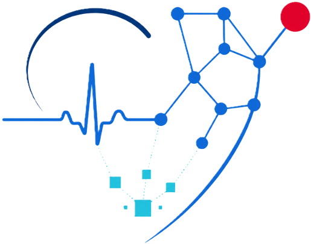

# AFIB-Predict

**Prédire la fibrillation atriale incidente à partir d'un ECG 12-dérivations et du dossier clinique — et mesurer ce que l'ECG apporte vraiment.**

Travail mené dans le cadre du Certificat de spécialisation *Intelligence artificielle en santé* du Cnam.

📄 **[Lire le manuscrit (PDF, 23 pages)](manuscrit/afib-predict-manuscrit.pdf)**

## La question

Prédire une fibrillation atriale (FA) *future* chez un patient qui n'en a pas n'est pas la même tâche que détecter une FA *présente* sur le tracé — la seconde est un problème largement résolu, la première beaucoup moins. La littérature ne s'accorde pas sur le point qui décide de l'intérêt clinique : le signal ECG ajoute-t-il quelque chose à ce que le dossier clinique prédit déjà ?

C'est cet apport **incrémental** que ce projet mesure, et rien d'autre.

## L'approche

- **Cohorte** — 138 083 patients de MIMIC-IV, indemnes de FA à leur ECG index. FA antérieure exclue sur les diagnostics ICD *et* les rapports de cardiologue. Décès traité en risque concurrent, censure pondérée (IPCW), séparation train/test **au niveau patient**, jamais au niveau ECG.
- **Six modèles emboîtés** — du clinique seul à la fusion clinique + représentation ECG, en passant par les marqueurs ECG conventionnels et une représentation apprise par un encodeur pré-entraîné, gelé puis adapté par LoRA.
- **Un pré-enregistrement signé** — les six bras, les cinq comparaisons et leurs interdits ont été figés dans un document daté *avant* toute ouverture du jeu de test. Celui-ci (27 618 patients, 838 événements à un an) a été ouvert **une seule fois**, le 27 août 2026 : aucun résultat n'a pu être choisi après coup.

## Ce qui en ressort

La fusion du dossier clinique et de la représentation apprise gagne **+0,058 d'AUC à un an** sur le modèle clinique seul (IC 95 % [+0,047 ; +0,069]), avec des risques cause-spécifiques calibrés. En pratique prédictive, la représentation apprise couvre l'information des marqueurs conventionnels ; l'inverse n'est pas vrai.

L'apport de l'**adaptation** de l'encodeur, qui semblait acquis en développement, **n'est pas établi** sur la réserve : +0,004, intervalle de confiance contenant zéro. Le dispositif permet de l'affirmer — comme de retirer ce qui ne tenait pas.

**Limites** : biais de surveillance et de sélection (base mono-centre), labels incomplets, puissance limitée pour les petits écarts, pas de validation externe. **Aucune utilité clinique n'est revendiquée** avant validation externe.

## Ce dépôt

Ce dépôt public présente le projet. Il ne contient **aucune donnée** : MIMIC-IV et MIMIC-IV-ECG sont distribuées par PhysioNet sous accord d'utilisation (DUA), et ni les signaux, ni les tables cliniques, ni aucun dérivé (embeddings compris) ne peuvent y figurer. L'accès aux données passe par PhysioNet, pas par ici.

Le manuscrit complet est ici, dans [`manuscrit/`](manuscrit/afib-predict-manuscrit.pdf). Le code, le vault de connaissance et les rapports d'expérience vivent dans un dépôt privé.

## Stack

Python 3.11 · [pixi](https://pixi.sh) pour l'environnement · Polars + Parquet · PyTorch · Transformers · scikit-survival, lifelines, pycox · marimo pour les notebooks · MLflow pour le suivi d'expériences · Quarto pour le manuscrit.

## Auteur

Rémi Castaing — Conservatoire national des arts et métiers.
